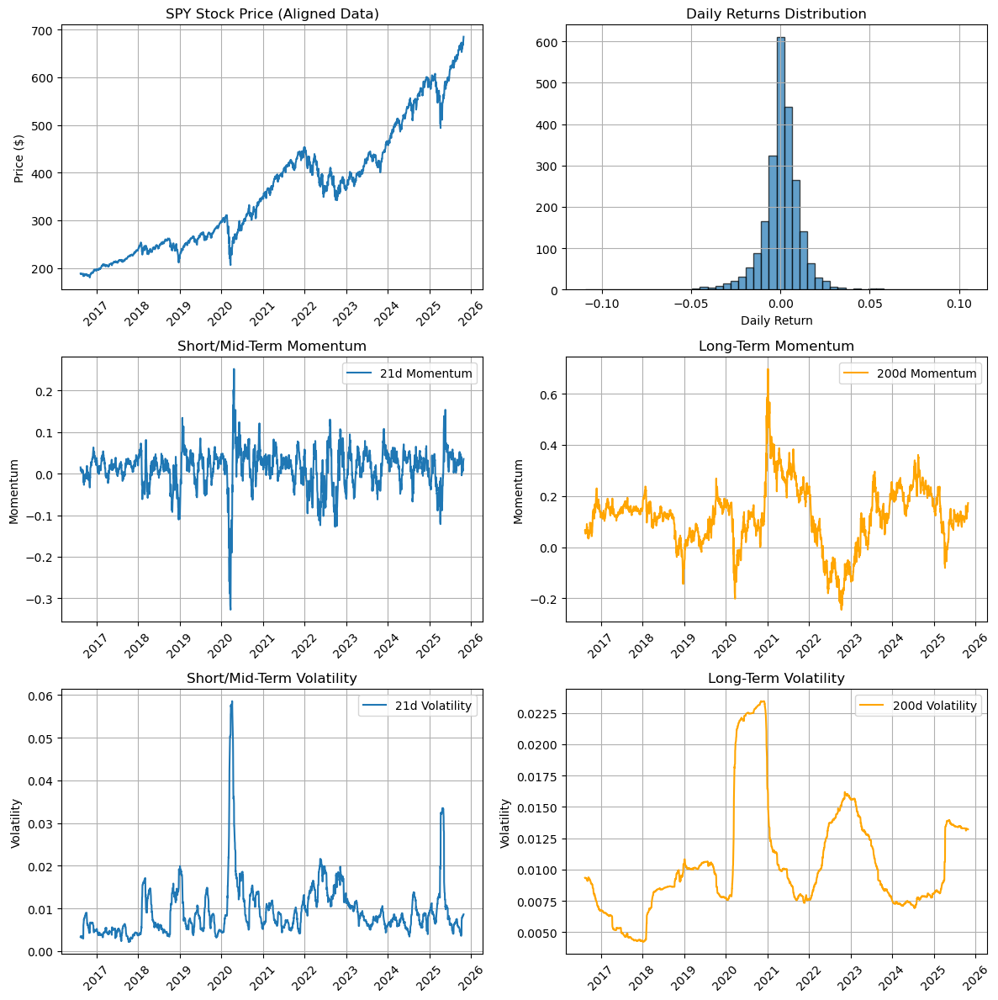
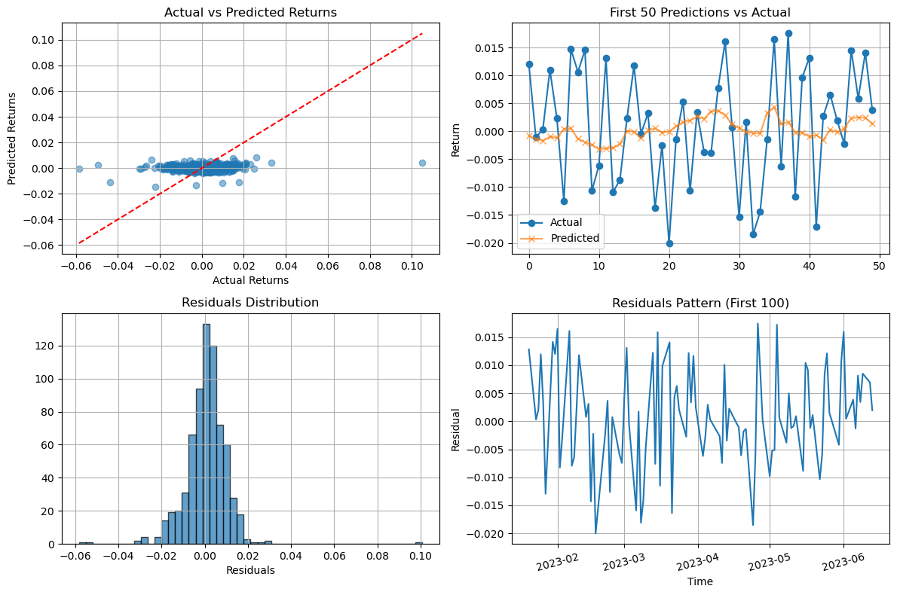
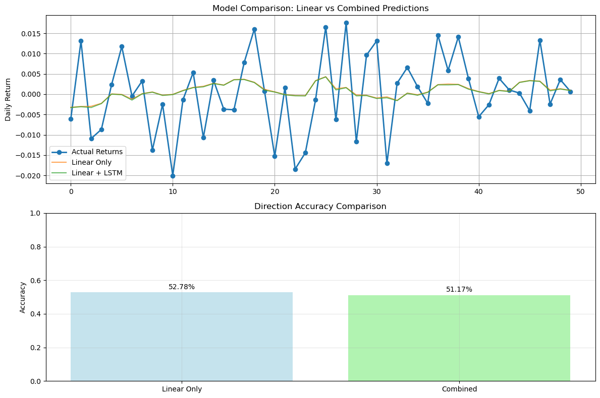

# Predicting SPY Returns with a Hybrid LR + LSTM Model

## Project Objective

This project documents an exploration into using Machine Learning techniques to predict the next-day percentage return of the S&P 500 ETF (ticker: SPY). As a first-year university student developing foundational knowledge in data science, the goal was to experiment with combining different modeling approaches.

The methodology involved:

1.  Establishing a baseline prediction using a Linear Regression (LR) model based on common technical indicators.
2.  Analyzing the prediction errors (residuals) from the LR model.
3.  Employing an LSTM (Long Short-Term Memory) neural network to model these residuals, attempting to capture patterns potentially missed by the linear model.
4.  Combining the LR and LSTM predictions into a hybrid model and evaluating whether this approach offered an improvement over the baseline LR model.

## Methodology and Implementation Steps

The project was implemented across three sequential Jupyter notebooks:

1.  **`data_analysis.ipynb`**:
    * **Data Acquisition**: Downloaded 10 years of historical SPY data via the `yfinance` library.
    * **Data Preparation**: Performed basic cleaning and formatting of the raw data.
    * **Feature Engineering**: Generated potential predictor variables (features) from the data, including:
        * Daily percentage returns.
        * Price momentum over 5, 21, 50, and 200-day periods.
        * Return volatility (standard deviation) over 5, 21, 50, and 200-day periods.
        * Ratios of short-term to long-term moving averages (5/21-day, 21/50-day, 50/200-day).
        * Daily volume relative to its 21-day average.
        * The target variable: the *actual* return on the subsequent day.
    * **Exploratory Data Analysis (EDA)**: Visualized the data and examined correlations between features and the target variable.

    

2.  **`linear_model.ipynb`**:
    * **Data Loading**: Utilized the features created in the previous notebook.
    * **Train-Test Split**: Divided the dataset chronologically into a training set (70%) and a test set (30%) to simulate real-world prediction scenarios.
    * **Model Training**: Trained a standard `LinearRegression` model (from scikit-learn) using the engineered features on the training data.
    * **Baseline Evaluation**: Assessed the LR model's performance on both training and test sets using Mean Squared Error (MSE), Mean Absolute Error (MAE), and directional accuracy (predicting up/down movement).
    * **Residual Analysis**: Calculated the difference between the LR model's predictions and the actual returns (residuals). Visualized the residuals to identify potential remaining patterns.

    

3.  **`lstm_residuals.ipynb`**:
    * **Data Preparation**: Loaded the residuals from the LR model.
    * **Data Scaling**: Applied `StandardScaler` to the residuals, a common practice for improving neural network training stability.
    * **Sequence Generation**: Transformed the time series of scaled residuals into input sequences (using a 10-day lookback window) suitable for the LSTM model.
    * **Hyperparameter Tuning**: Utilized the `keras-tuner` library (`RandomSearch`) to systematically explore different LSTM configurations (number of units, dropout rate, dense layer units, learning rate) and identify a well-performing set of parameters.
    * **LSTM Training**: Trained the best LSTM model identified by the tuner using TensorFlow/Keras on the sequences of scaled training residuals.
    * **Prediction and Inverse Scaling**: Generated predictions for the scaled test set residuals using the trained LSTM and transformed these predictions back to the original residual scale.
    * **Hybrid Model Construction**: Combined the baseline LR model's test predictions with the LSTM's residual predictions, ensuring correct temporal alignment.
    * **Comparative Evaluation**: Compared the performance (MAE, directional accuracy, cost-adjusted accuracy) of the final hybrid model against the baseline LR model on the aligned test data.
    * **Visualization**: Plotted the results for comparison.

## Libraries Utilized

* `pandas`: For data manipulation and analysis.
* `numpy`: For numerical computation.
* `yfinance`: For downloading financial data.
* `matplotlib`: For generating plots.
* `scikit-learn`: For Linear Regression, performance metrics, and data scaling.
* `tensorflow` / `keras`: For building and training the LSTM neural network.
* `keras-tuner`: For automating hyperparameter searches.
* `pickle`: For saving/loading intermediate results (optional).

## Execution Instructions

1.  Ensure Python 3 is installed.
2.  Install the required libraries using pip:
    ```bash
    pip install pandas numpy yfinance matplotlib scikit-learn tensorflow keras-tuner
    ```
3.  Download or clone the project files. Ensure the plot images (`output.png`, `linear.png`, `resid.png`) are placed in an `images` subfolder.
4.  Execute the Jupyter notebooks sequentially in a suitable environment (like Jupyter Lab or VS Code):
    * `data_analysis.ipynb`
    * `linear_model.ipynb`
    * `lstm_residuals.ipynb`

## Observations

* The baseline Linear Regression model demonstrated a directional accuracy (excluding zero-return days) of approximately **52.78%** on the unseen test data (using the aligned portion for fair comparison).
* Analysis of the LR residuals (see plot above) indicated potential non-random patterns, suggesting that a non-linear model like an LSTM might capture additional information.
* The hybrid LR+LSTM model resulted in a directional accuracy (excluding zero-return days) of **51.17%** on the test set. In this instance, this represents a relative **decrease of -1.61%** compared to the LR baseline alone. While the LSTM didn't improve accuracy in this specific tuned configuration, the process demonstrated the hybrid modeling technique.
* The use of `keras-tuner` facilitated the process of finding effective hyperparameters for the LSTM component based on validation loss.



## Learning Outcomes and Potential Extensions

* This project provided practical experience in time series data handling, feature engineering for financial markets, and implementing both linear and recurrent neural network models.
* Served as an introduction to fundamental concepts of **regression modeling** and **LSTM networks** within the context of financial data.
* Gained familiarity with standard evaluation metrics and the importance of chronological train-test splitting for time series data.
* Experienced the utility of hyperparameter tuning libraries like `keras-tuner`.
* Observed the concept of hybrid modeling, where different model types are combined to potentially improve predictive performance (though improvement wasn't achieved in this specific run).
* Served as an initial hands-on experience using Jupyter Notebooks for data analysis and model development.

Potential areas for future exploration include:

* Investigating alternative or additional features (e.g., macroeconomic indicators).
* Experimenting with different LSTM architectures (e.g., stacked or bidirectional LSTMs) or sequence lengths, potentially including further hyperparameter tuning focused specifically on directional accuracy.
* Comparing the hybrid model's performance against other time series forecasting methods (e.g., ARIMA, Prophet).
* Applying the methodology to different financial instruments or prediction horizons.
